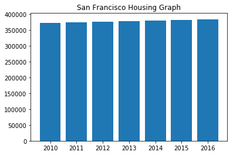

# San Francisco Housing Cost Analysis

In this assignment, you will perform fundamental analysis for the San Francisco housing market to allow potential real estate investors to choose rental investment properties.


```python
!pip install numpy==1.18.1 --user
```

    Requirement already satisfied: numpy==1.18.1 in /Users/abdishakibfarah/opt/anaconda3/envs/pyvizenv/lib/python3.7/site-packages (1.18.1)


```python
# imports
import panel as pn
pn.extension('plotly')
import plotly.express as px
import pandas as pd
import hvplot.pandas
import matplotlib.pyplot as plt
import numpy as np
import os
from pathlib import Path
from dotenv import load_dotenv

import warnings
warnings.filterwarnings('ignore')
```


```python
# Read the Mapbox API key
load_dotenv()
map_box_api = os.getenv("Mapbox.env")
```

## Load Data


```python

```


```python
# Read the census data into a Pandas DataFrame
file_path = Path("Data/sfo_neighborhoods_census_data.csv")
sfo_data = pd.read_csv(file_path, index_col="year")
sfo_data.head()
```


<div>
<style scoped>
    .dataframe tbody tr th:only-of-type {
        vertical-align: middle;
    }

    .dataframe tbody tr th {
        vertical-align: top;
    }

    .dataframe thead th {
        text-align: right;
    }
</style>
<table border="1" class="dataframe">
  <thead>
    <tr style="text-align: right;">
      <th></th>
      <th>neighborhood</th>
      <th>sale_price_sqr_foot</th>
      <th>housing_units</th>
      <th>gross_rent</th>
    </tr>
    <tr>
      <th>year</th>
      <th></th>
      <th></th>
      <th></th>
      <th></th>
    </tr>
  </thead>
  <tbody>
    <tr>
      <th>2010</th>
      <td>Alamo Square</td>
      <td>291.182945</td>
      <td>372560</td>
      <td>1239</td>
    </tr>
    <tr>
      <th>2010</th>
      <td>Anza Vista</td>
      <td>267.932583</td>
      <td>372560</td>
      <td>1239</td>
    </tr>
    <tr>
      <th>2010</th>
      <td>Bayview</td>
      <td>170.098665</td>
      <td>372560</td>
      <td>1239</td>
    </tr>
    <tr>
      <th>2010</th>
      <td>Buena Vista Park</td>
      <td>347.394919</td>
      <td>372560</td>
      <td>1239</td>
    </tr>
    <tr>
      <th>2010</th>
      <td>Central Richmond</td>
      <td>319.027623</td>
      <td>372560</td>
      <td>1239</td>
    </tr>
  </tbody>
</table>
</div>


```python

```

- - - 

## Housing Units Per Year

In this section, you will calculate the number of housing units per year and visualize the results as a bar chart using the Pandas plot function.

**Hint:** Use the Pandas `groupby` function.

**Optional challenge:** Use the min, max, and std to scale the y limits of the chart.


```python
# Calculate the mean number of housing units per year (hint: use groupby) 
# YOUR CODE HERE!
sfo_data_hu = sfo_data[['housing_units']].groupby(sfo_data.index).mean()
sfo_data_hu
```


<div>
<style scoped>
    .dataframe tbody tr th:only-of-type {
        vertical-align: middle;
    }

    .dataframe tbody tr th {
        vertical-align: top;
    }

    .dataframe thead th {
        text-align: right;
    }
</style>
<table border="1" class="dataframe">
  <thead>
    <tr style="text-align: right;">
      <th></th>
      <th>housing_units</th>
    </tr>
    <tr>
      <th>year</th>
      <th></th>
    </tr>
  </thead>
  <tbody>
    <tr>
      <th>2010</th>
      <td>372560</td>
    </tr>
    <tr>
      <th>2011</th>
      <td>374507</td>
    </tr>
    <tr>
      <th>2012</th>
      <td>376454</td>
    </tr>
    <tr>
      <th>2013</th>
      <td>378401</td>
    </tr>
    <tr>
      <th>2014</th>
      <td>380348</td>
    </tr>
    <tr>
      <th>2015</th>
      <td>382295</td>
    </tr>
    <tr>
      <th>2016</th>
      <td>384242</td>
    </tr>
  </tbody>
</table>
</div>


```python
# Save the dataframe as a csv file
# YOUR CODE HERE!
sfo_data_hu.to_csv('sfo_data_housing_units')
```


```python
# Use the Pandas plot function to plot the average housing units per year.
# Note: You will need to manually adjust the y limit of the chart using the min and max values from above.
# YOUR CODE HERE!
fig = plt.figure()
plt.bar(sfo_data_hu.index, sfo_data_hu['housing_units'])
plt.title('San Francisco Housing Graph')
plt.show()
plt.close()

# Optional Challenge: Use the min, max, and std to scale the y limits of the chart
# YOUR CODE HERE!
```


    

    


- - - 

## Average Housing Costs in San Francisco Per Year

In this section, you will calculate the average monthly rent and the average price per square foot for each year. An investor may wish to better understand the sales price of the rental property over time. For example, a customer will want to know if they should expect an increase or decrease in the property value over time so they can determine how long to hold the rental property.  Plot the results as two line charts.

**Optional challenge:** Plot each line chart in a different color.


```python
# Calculate the average sale price per square foot and average gross rent
# YOUR CODE HERE!
sfo_data_hu_1 = sfo_data[['sale_price_sqr_foot', 'gross_rent']].groupby(sfo_data.index).mean()
sfo_data_hu_1.head()
```


<div>
<style scoped>
    .dataframe tbody tr th:only-of-type {
        vertical-align: middle;
    }

    .dataframe tbody tr th {
        vertical-align: top;
    }

    .dataframe thead th {
        text-align: right;
    }
</style>
<table border="1" class="dataframe">
  <thead>
    <tr style="text-align: right;">
      <th></th>
      <th>sale_price_sqr_foot</th>
      <th>gross_rent</th>
    </tr>
    <tr>
      <th>year</th>
      <th></th>
      <th></th>
    </tr>
  </thead>
  <tbody>
    <tr>
      <th>2010</th>
      <td>369.344353</td>
      <td>1239</td>
    </tr>
    <tr>
      <th>2011</th>
      <td>341.903429</td>
      <td>1530</td>
    </tr>
    <tr>
      <th>2012</th>
      <td>399.389968</td>
      <td>2324</td>
    </tr>
    <tr>
      <th>2013</th>
      <td>483.600304</td>
      <td>2971</td>
    </tr>
    <tr>
      <th>2014</th>
      <td>556.277273</td>
      <td>3528</td>
    </tr>
  </tbody>
</table>
</div>


```python
# Create two line charts, one to plot the average sale price per square foot and another for average montly rent

# Line chart for average sale price per square foot
# YOUR CODE HERE!


# Line chart for average montly rent
# YOUR CODE HERE!
```

- - - 

## Average Prices by Neighborhood

In this section, you will use hvplot to create two interactive visulizations of average prices with a dropdown selector for the neighborhood. The first visualization will be a line plot showing the trend of average price per square foot over time for each neighborhood.  The second will be a line plot showing the trend of average montly rent over time for each neighborhood.

**Hint:** It will be easier to create a new DataFrame from grouping the data and calculating the mean prices for each year and neighborhood


```python
#Group by year and neighborhood and then create a new dataframe of the mean values
#YOUR CODE HERE!

sfo_data_hu_2= sfo_data.groupby([sfo_data.index, 'neighborhood']).mean().reset_index()
sfo_data_hu_2.head()
```


<div>
<style scoped>
    .dataframe tbody tr th:only-of-type {
        vertical-align: middle;
    }

    .dataframe tbody tr th {
        vertical-align: top;
    }

    .dataframe thead th {
        text-align: right;
    }
</style>
<table border="1" class="dataframe">
  <thead>
    <tr style="text-align: right;">
      <th></th>
      <th>year</th>
      <th>neighborhood</th>
      <th>sale_price_sqr_foot</th>
      <th>housing_units</th>
      <th>gross_rent</th>
    </tr>
  </thead>
  <tbody>
    <tr>
      <th>0</th>
      <td>2010</td>
      <td>Alamo Square</td>
      <td>291.182945</td>
      <td>372560</td>
      <td>1239</td>
    </tr>
    <tr>
      <th>1</th>
      <td>2010</td>
      <td>Anza Vista</td>
      <td>267.932583</td>
      <td>372560</td>
      <td>1239</td>
    </tr>
    <tr>
      <th>2</th>
      <td>2010</td>
      <td>Bayview</td>
      <td>170.098665</td>
      <td>372560</td>
      <td>1239</td>
    </tr>
    <tr>
      <th>3</th>
      <td>2010</td>
      <td>Buena Vista Park</td>
      <td>347.394919</td>
      <td>372560</td>
      <td>1239</td>
    </tr>
    <tr>
      <th>4</th>
      <td>2010</td>
      <td>Central Richmond</td>
      <td>319.027623</td>
      <td>372560</td>
      <td>1239</td>
    </tr>
  </tbody>
</table>
</div>


```python
# Use hvplot to create an interactive line chart of the average price per sq ft.
# The plot should have a dropdown selector for the neighborhood
# YOUR CODE HERE!
plot_avg_rent_neighborhood = sfo_data_hu_2.hvplot(x='year', y='sale_price_sqr_foot', groupby='neighborhood', ylabel='Avg: Sale Price per Square Foot')
plot_avg_rent_neighborhood
```


<div id='4817'>


  <div class="bk-root" id="74525bb4-cda3-4ba3-8c6a-0dd1ea28080e" data-root-id="4817"></div>
</div>
<script type="application/javascript">(function(root) {
  function embed_document(root) {
    var docs_json = {"4b081c97-b48b-4369-81bd-ba308afb8bc0":{"roots":{"references":[{"attributes":{"margin":[5,5,5,5],"name":"VSpacer08851","sizing_mode":"stretch_height"},"id":"4889","type":"Spacer"},{"attributes":{},"id":"4843","type":"ResetTool"},{"attributes":{"margin":[5,5,5,5],"name":"HSpacer08854","sizing_mode":"stretch_width"},"id":"4884","type":"Spacer"},{"attributes":{"children":[{"id":"4886"},{"id":"4887"},{"id":"4889"}],"margin":[0,0,0,0],"name":"Column08852"},"id":"4885","type":"Column"},{"attributes":{},"id":"4829","type":"LinearScale"},{"attributes":{"margin":[20,20,20,20],"min_width":250,"options":["Alamo Square","Anza Vista","Bayview","Buena Vista Park","Central Richmond","Central Sunset","Corona Heights","Cow Hollow","Croker Amazon","Diamond Heights","Downtown ","Eureka Valley/Dolores Heights","Excelsior","Financial District North","Financial District South","Forest Knolls","Glen Park","Golden Gate Heights","Haight Ashbury","Hayes Valley","Hunters Point","Ingleside ","Inner Mission","Inner Parkside","Inner Richmond","Inner Sunset","Jordan Park/Laurel Heights","Lake --The Presidio","Lone Mountain","Lower Pacific Heights","Marina","Miraloma Park","Mission Bay","Mission Dolores","Mission Terrace","Nob Hill","Noe Valley","Oceanview","Outer Parkside","Outer Richmond ","Outer Sunset","Pacific Heights","Park North","Parkside","Parnassus/Ashbury Heights","Portola","Potrero Hill","Presidio Heights","Russian Hill","South Beach","South of Market","Sunnyside","Telegraph Hill","Twin Peaks","Union Square District","Van Ness/ Civic Center","West Portal","Western Addition","Yerba Buena","Bernal Heights ","Clarendon Heights","Duboce Triangle","Ingleside Heights","North Beach","North Waterfront","Outer Mission","Westwood Highlands","Merced Heights","Midtown Terrace","Visitacion Valley","Silver Terrace","Westwood Park","Bayview Heights"],"title":"neighborhood","value":"Alamo Square","width":250},"id":"4888","type":"Select"},{"attributes":{"axis_label":"year","bounds":"auto","formatter":{"id":"4861"},"major_label_orientation":"horizontal","ticker":{"id":"4832"}},"id":"4831","type":"LinearAxis"},{"attributes":{"axis":{"id":"4835"},"dimension":1,"grid_line_color":null,"ticker":null},"id":"4838","type":"Grid"},{"attributes":{"margin":[5,5,5,5],"name":"HSpacer08853","sizing_mode":"stretch_width"},"id":"4818","type":"Spacer"},{"attributes":{"below":[{"id":"4831"}],"center":[{"id":"4834"},{"id":"4838"}],"left":[{"id":"4835"}],"margin":[5,5,5,5],"min_border_bottom":10,"min_border_left":10,"min_border_right":10,"min_border_top":10,"plot_height":300,"plot_width":700,"renderers":[{"id":"4858"}],"sizing_mode":"fixed","title":{"id":"4823"},"toolbar":{"id":"4845"},"x_range":{"id":"4819"},"x_scale":{"id":"4827"},"y_range":{"id":"4820"},"y_scale":{"id":"4829"}},"id":"4822","subtype":"Figure","type":"Plot"},{"attributes":{},"id":"4832","type":"BasicTicker"},{"attributes":{},"id":"4875","type":"UnionRenderers"},{"attributes":{"end":2016.0,"reset_end":2016.0,"reset_start":2010.0,"start":2010.0,"tags":[[["year","year",null]]]},"id":"4819","type":"Range1d"},{"attributes":{"axis":{"id":"4831"},"grid_line_color":null,"ticker":null},"id":"4834","type":"Grid"},{"attributes":{"text":"neighborhood: Alamo Square","text_color":{"value":"black"},"text_font_size":{"value":"12pt"}},"id":"4823","type":"Title"},{"attributes":{"line_alpha":0.1,"line_color":"#30a2da","line_width":2,"x":{"field":"year"},"y":{"field":"sale_price_sqr_foot"}},"id":"4856","type":"Line"},{"attributes":{"margin":[5,5,5,5],"name":"VSpacer08850","sizing_mode":"stretch_height"},"id":"4886","type":"Spacer"},{"attributes":{},"id":"4836","type":"BasicTicker"},{"attributes":{"line_alpha":0.2,"line_color":"#30a2da","line_width":2,"x":{"field":"year"},"y":{"field":"sale_price_sqr_foot"}},"id":"4857","type":"Line"},{"attributes":{"axis_label":"Avg: Sale Price per Square Foot","bounds":"auto","formatter":{"id":"4863"},"major_label_orientation":"horizontal","ticker":{"id":"4836"}},"id":"4835","type":"LinearAxis"},{"attributes":{"children":[{"id":"4818"},{"id":"4822"},{"id":"4884"},{"id":"4885"}],"margin":[0,0,0,0],"name":"Row08844"},"id":"4817","type":"Row"},{"attributes":{},"id":"4861","type":"BasicTickFormatter"},{"attributes":{"bottom_units":"screen","fill_alpha":0.5,"fill_color":"lightgrey","left_units":"screen","level":"overlay","line_alpha":1.0,"line_color":"black","line_dash":[4,4],"line_width":2,"right_units":"screen","top_units":"screen"},"id":"4844","type":"BoxAnnotation"},{"attributes":{"data_source":{"id":"4852"},"glyph":{"id":"4855"},"hover_glyph":null,"muted_glyph":{"id":"4857"},"nonselection_glyph":{"id":"4856"},"selection_glyph":null,"view":{"id":"4859"}},"id":"4858","type":"GlyphRenderer"},{"attributes":{"children":[{"id":"4888"}],"css_classes":["panel-widget-box"],"margin":[5,5,5,5],"name":"WidgetBox08845"},"id":"4887","type":"Column"},{"attributes":{"data":{"sale_price_sqr_foot":{"__ndarray__":"Dkc7WO0yckCafszcbwhxQIGRs5ot42ZAJzog0LQ8eEAWMinKGEd+QI0V5FDt0IJAVCHcmLVPdUA=","dtype":"float64","order":"little","shape":[7]},"year":[2010,2011,2012,2013,2014,2015,2016]},"selected":{"id":"4853"},"selection_policy":{"id":"4875"}},"id":"4852","type":"ColumnDataSource"},{"attributes":{"active_drag":"auto","active_inspect":"auto","active_multi":null,"active_scroll":"auto","active_tap":"auto","tools":[{"id":"4821"},{"id":"4839"},{"id":"4840"},{"id":"4841"},{"id":"4842"},{"id":"4843"}]},"id":"4845","type":"Toolbar"},{"attributes":{},"id":"4839","type":"SaveTool"},{"attributes":{"source":{"id":"4852"}},"id":"4859","type":"CDSView"},{"attributes":{},"id":"4853","type":"Selection"},{"attributes":{"callback":null,"renderers":[{"id":"4858"}],"tags":["hv_created"],"tooltips":[["year","@{year}"],["sale_price_sqr_foot","@{sale_price_sqr_foot}"]]},"id":"4821","type":"HoverTool"},{"attributes":{},"id":"4840","type":"PanTool"},{"attributes":{},"id":"4841","type":"WheelZoomTool"},{"attributes":{"line_color":"#30a2da","line_width":2,"x":{"field":"year"},"y":{"field":"sale_price_sqr_foot"}},"id":"4855","type":"Line"},{"attributes":{"client_comm_id":"f53fca0547e94ed98b62e8b84c4eb154","comm_id":"a7cc5a325ce94c2da3b380b367b8ca0d","plot_id":"4817"},"id":"4914","type":"panel.models.comm_manager.CommManager"},{"attributes":{},"id":"4863","type":"BasicTickFormatter"},{"attributes":{"overlay":{"id":"4844"}},"id":"4842","type":"BoxZoomTool"},{"attributes":{},"id":"4827","type":"LinearScale"},{"attributes":{"end":644.0175329447045,"reset_end":644.0175329447045,"reset_start":141.1976609302527,"start":141.1976609302527,"tags":[[["sale_price_sqr_foot","sale_price_sqr_foot",null]]]},"id":"4820","type":"Range1d"}],"root_ids":["4817","4914"]},"title":"Bokeh Application","version":"2.2.3"}};
    var render_items = [{"docid":"4b081c97-b48b-4369-81bd-ba308afb8bc0","root_ids":["4817"],"roots":{"4817":"74525bb4-cda3-4ba3-8c6a-0dd1ea28080e"}}];
    root.Bokeh.embed.embed_items_notebook(docs_json, render_items);
  }
  if (root.Bokeh !== undefined && root.Bokeh.Panel !== undefined && root['Plotly'] !== undefined ) {
    embed_document(root);
  } else {
    var attempts = 0;
    var timer = setInterval(function(root) {
      if (root.Bokeh !== undefined && root.Bokeh.Panel !== undefined && root['Plotly'] !== undefined) {
        clearInterval(timer);
        embed_document(root);
      } else if (document.readyState == "complete") {
        attempts++;
        if (attempts > 100) {
          clearInterval(timer);
          console.log("Bokeh: ERROR: Unable to run BokehJS code because BokehJS library is missing");
        }
      }
    }, 10, root)
  }
})(window);</script>


```python
# Use hvplot to create an interactive line chart of the average monthly rent.
# The plot should have a dropdown selector for the neighborhood
# YOUR CODE HERE!
avg_monthly_rent = sfo_data_hu_2.hvplot(x='year', y='gross_rent', ylabel='Avg: Gross Rent per year', groupby='neighborhood')


```

## The Top 10 Most Expensive Neighborhoods

In this section, you will need to calculate the mean sale price per square foot for each neighborhood and then sort the values to obtain the top 10 most expensive neighborhoods on average. Plot the results as a bar chart.


```python
# Getting the data from the top 10 expensive neighborhoods to own
# YOUR CODE HERE!
sfo_data_hu_2= sfo_data.groupby([sfo_data.index, 'neighborhood']).mean().reset_index

sfo_data_hu_2
```


    <bound method DataFrame.reset_index of                                     sale_price_sqr_foot  housing_units  \
    year neighborhood                                                        
    2010 Alamo Square                            291.182945         372560   
         Anza Vista                              267.932583         372560   
         Bayview                                 170.098665         372560   
         Buena Vista Park                        347.394919         372560   
         Central Richmond                        319.027623         372560   
         Central Sunset                          418.172493         372560   
         Corona Heights                          369.359338         372560   
         Cow Hollow                              569.379968         372560   
         Croker Amazon                           165.645730         372560   
         Diamond Heights                         456.930822         372560   
         Downtown                                241.804552         372560   
         Eureka Valley/Dolores Heights           403.118313         372560   
         Excelsior                               364.928336         372560   
         Financial District North                401.749967         372560   
         Financial District South                162.821210         372560   
         Forest Knolls                           209.049327         372560   
         Glen Park                               715.586438         372560   
         Golden Gate Heights                     551.801119         372560   
         Haight Ashbury                          254.473779         372560   
         Hayes Valley                            272.284980         372560   
         Hunters Point                           170.624920         372560   
         Ingleside                               275.056686         372560   
         Inner Mission                           238.350020         372560   
         Inner Parkside                          199.702004         372560   
         Inner Richmond                          285.822358         372560   
         Inner Sunset                            275.769730         372560   
         Jordan Park/Laurel Heights              419.887812         372560   
         Lake --The Presidio                     320.796910         372560   
         Lone Mountain                           398.458876         372560   
         Lower Pacific Heights                   374.057636         372560   
    ...                                                 ...            ...   
    2016 Inner Mission                           647.770447         384242   
         Inner Parkside                          518.112650         384242   
         Inner Richmond                          403.311132         384242   
         Inner Sunset                            445.923828         384242   
         Jordan Park/Laurel Heights              704.566419         384242   
         Lower Pacific Heights                   636.430770         384242   
         Marina                                  431.944602         384242   
         Merced Heights                         1416.666667         384242   
         Mission Bay                             924.569116         384242   
         Mission Terrace                         879.017013         384242   
         Nob Hill                                777.008315         384242   
         Noe Valley                              799.495651         384242   
         North Beach                             407.553322         384242   
         Outer Mission                            40.772625         384242   
         Outer Parkside                          732.720684         384242   
         Outer Richmond                         1196.645437         384242   
         Outer Sunset                            510.576907         384242   
         Pacific Heights                         996.389364         384242   
         Park North                              211.301370         384242   
         Parnassus/Ashbury Heights              1207.997485         384242   
         Potrero Hill                            707.651609         384242   
         Presidio Heights                       1465.968586         384242   
         Russian Hill                           1024.339877         384242   
         South of Market                         531.136374         384242   
         Sunnyside                               751.173709         384242   
         Telegraph Hill                          903.049771         384242   
         Twin Peaks                              970.085470         384242   
         Van Ness/ Civic Center                  552.602567         384242   
         Visitacion Valley                       328.319007         384242   
         Westwood Park                           631.195426         384242   
    
                                        gross_rent  
    year neighborhood                               
    2010 Alamo Square                         1239  
         Anza Vista                           1239  
         Bayview                              1239  
         Buena Vista Park                     1239  
         Central Richmond                     1239  
         Central Sunset                       1239  
         Corona Heights                       1239  
         Cow Hollow                           1239  
         Croker Amazon                        1239  
         Diamond Heights                      1239  
         Downtown                             1239  
         Eureka Valley/Dolores Heights        1239  
         Excelsior                            1239  
         Financial District North             1239  
         Financial District South             1239  
         Forest Knolls                        1239  
         Glen Park                            1239  
         Golden Gate Heights                  1239  
         Haight Ashbury                       1239  
         Hayes Valley                         1239  
         Hunters Point                        1239  
         Ingleside                            1239  
         Inner Mission                        1239  
         Inner Parkside                       1239  
         Inner Richmond                       1239  
         Inner Sunset                         1239  
         Jordan Park/Laurel Heights           1239  
         Lake --The Presidio                  1239  
         Lone Mountain                        1239  
         Lower Pacific Heights                1239  
    ...                                        ...  
    2016 Inner Mission                        4390  
         Inner Parkside                       4390  
         Inner Richmond                       4390  
         Inner Sunset                         4390  
         Jordan Park/Laurel Heights           4390  
         Lower Pacific Heights                4390  
         Marina                               4390  
         Merced Heights                       4390  
         Mission Bay                          4390  
         Mission Terrace                      4390  
         Nob Hill                             4390  
         Noe Valley                           4390  
         North Beach                          4390  
         Outer Mission                        4390  
         Outer Parkside                       4390  
         Outer Richmond                       4390  
         Outer Sunset                         4390  
         Pacific Heights                      4390  
         Park North                           4390  
         Parnassus/Ashbury Heights            4390  
         Potrero Hill                         4390  
         Presidio Heights                     4390  
         Russian Hill                         4390  
         South of Market                      4390  
         Sunnyside                            4390  
         Telegraph Hill                       4390  
         Twin Peaks                           4390  
         Van Ness/ Civic Center               4390  
         Visitacion Valley                    4390  
         Westwood Park                        4390  
    
    [397 rows x 3 columns]>


```python
# Plotting the data from the top 10 expensive neighborhoods
# YOUR CODE HERE!
top_ten_expensive_neighborhood =sfo_data_hu_2.hvplot.bar(title='Top 10 Expensive Neighborhoods in San Francisco',
                                                                         y='sale_price_sqr_foot',
                                                                         ylabel='Avg: Sale Price per Square Foot',
                                                                         xlabel='neighborhood',
                                                                         rot=80,
                                                                         frame_height=300,
                                                                         frame_width=850,
                                                                        
                                                                            
                                                                        
                                                                          
                                                                        )
                                                                   
    
top_ten_expensive_neighborhood
  
```


<div id='5093'>


  <div class="bk-root" id="c9971b87-c7b7-4fce-9151-0334697b17a4" data-root-id="5093"></div>
</div>
<script type="application/javascript">(function(root) {
  function embed_document(root) {
    var docs_json = {"42c5cabc-5745-4e6a-9e8a-af86a38cefe2":{"roots":{"references":[{"attributes":{"fill_color":{"value":"#30a2da"},"top":{"field":"sale_price_sqr_foot"},"width":{"value":0.8},"x":{"field":"index"}},"id":"5130","type":"VBar"},{"attributes":{},"id":"5114","type":"SaveTool"},{"attributes":{"axis":{"id":"5110"},"dimension":1,"grid_line_color":null,"ticker":null},"id":"5113","type":"Grid"},{"attributes":{},"id":"5115","type":"PanTool"},{"attributes":{},"id":"5146","type":"UnionRenderers"},{"attributes":{"data_source":{"id":"5127"},"glyph":{"id":"5130"},"hover_glyph":null,"muted_glyph":{"id":"5132"},"nonselection_glyph":{"id":"5131"},"selection_glyph":null,"view":{"id":"5134"}},"id":"5133","type":"GlyphRenderer"},{"attributes":{},"id":"5103","type":"CategoricalScale"},{"attributes":{},"id":"5116","type":"WheelZoomTool"},{"attributes":{"active_drag":"auto","active_inspect":"auto","active_multi":null,"active_scroll":"auto","active_tap":"auto","tools":[{"id":"5097"},{"id":"5114"},{"id":"5115"},{"id":"5116"},{"id":"5117"},{"id":"5118"}]},"id":"5120","type":"Toolbar"},{"attributes":{"overlay":{"id":"5119"}},"id":"5117","type":"BoxZoomTool"},{"attributes":{"below":[{"id":"5107"}],"center":[{"id":"5109"},{"id":"5113"}],"frame_height":300,"frame_width":850,"left":[{"id":"5110"}],"margin":[5,5,5,5],"min_border_bottom":10,"min_border_left":10,"min_border_right":10,"min_border_top":10,"plot_height":null,"plot_width":null,"renderers":[{"id":"5133"}],"sizing_mode":"fixed","title":{"id":"5099"},"toolbar":{"id":"5120"},"x_range":{"id":"5095"},"x_scale":{"id":"5103"},"y_range":{"id":"5096"},"y_scale":{"id":"5105"}},"id":"5098","subtype":"Figure","type":"Plot"},{"attributes":{"fill_alpha":{"value":0.2},"fill_color":{"value":"#30a2da"},"line_alpha":{"value":0.2},"top":{"field":"sale_price_sqr_foot"},"width":{"value":0.8},"x":{"field":"index"}},"id":"5132","type":"VBar"},{"attributes":{"children":[{"id":"5094"},{"id":"5098"},{"id":"5155"}],"margin":[0,0,0,0],"name":"Row09435","tags":["embedded"]},"id":"5093","type":"Row"},{"attributes":{"source":{"id":"5127"}},"id":"5134","type":"CDSView"},{"attributes":{"factors":["0","1","2","3","4","5","6","7","8","9","10","11","12","13","14","15","16","17","18","19","20","21","22","23","24","25","26","27","28","29","30","31","32","33","34","35","36","37","38","39","40","41","42","43","44","45","46","47","48","49","50","51","52","53","54","55","56","57","58","59","60","61","62","63","64","65","66","67","68","69","70","71","72","73","74","75","76","77","78","79","80","81","82","83","84","85","86","87","88","89","90","91","92","93","94","95","96","97","98","99","100","101","102","103","104","105","106","107","108","109","110","111","112","113","114","115","116","117","118","119","120","121","122","123","124","125","126","127","128","129","130","131","132","133","134","135","136","137","138","139","140","141","142","143","144","145","146","147","148","149","150","151","152","153","154","155","156","157","158","159","160","161","162","163","164","165","166","167","168","169","170","171","172","173","174","175","176","177","178","179","180","181","182","183","184","185","186","187","188","189","190","191","192","193","194","195","196","197","198","199","200","201","202","203","204","205","206","207","208","209","210","211","212","213","214","215","216","217","218","219","220","221","222","223","224","225","226","227","228","229","230","231","232","233","234","235","236","237","238","239","240","241","242","243","244","245","246","247","248","249","250","251","252","253","254","255","256","257","258","259","260","261","262","263","264","265","266","267","268","269","270","271","272","273","274","275","276","277","278","279","280","281","282","283","284","285","286","287","288","289","290","291","292","293","294","295","296","297","298","299","300","301","302","303","304","305","306","307","308","309","310","311","312","313","314","315","316","317","318","319","320","321","322","323","324","325","326","327","328","329","330","331","332","333","334","335","336","337","338","339","340","341","342","343","344","345","346","347","348","349","350","351","352","353","354","355","356","357","358","359","360","361","362","363","364","365","366","367","368","369","370","371","372","373","374","375","376","377","378","379","380","381","382","383","384","385","386","387","388","389","390","391","392","393","394","395","396"],"tags":[[["index","index",null]]]},"id":"5095","type":"FactorRange"},{"attributes":{"fill_alpha":{"value":0.1},"fill_color":{"value":"#30a2da"},"line_alpha":{"value":0.1},"top":{"field":"sale_price_sqr_foot"},"width":{"value":0.8},"x":{"field":"index"}},"id":"5131","type":"VBar"},{"attributes":{},"id":"5118","type":"ResetTool"},{"attributes":{"callback":null,"renderers":[{"id":"5133"}],"tags":["hv_created"],"tooltips":[["index","@{index}"],["sale_price_sqr_foot","@{sale_price_sqr_foot}"]]},"id":"5097","type":"HoverTool"},{"attributes":{},"id":"5136","type":"CategoricalTickFormatter"},{"attributes":{},"id":"5105","type":"LinearScale"},{"attributes":{"margin":[5,5,5,5],"name":"HSpacer09439","sizing_mode":"stretch_width"},"id":"5094","type":"Spacer"},{"attributes":{"end":2480.495852663006,"reset_end":2480.495852663006,"reset_start":0.0,"tags":[[["sale_price_sqr_foot","sale_price_sqr_foot",null]]]},"id":"5096","type":"Range1d"},{"attributes":{"axis_label":"neighborhood","bounds":"auto","formatter":{"id":"5136"},"major_label_orientation":1.3962634015954636,"ticker":{"id":"5108"}},"id":"5107","type":"CategoricalAxis"},{"attributes":{"text":"Top 10 Expensive Neighborhoods in San Francisco","text_color":{"value":"black"},"text_font_size":{"value":"12pt"}},"id":"5099","type":"Title"},{"attributes":{},"id":"5138","type":"BasicTickFormatter"},{"attributes":{},"id":"5108","type":"CategoricalTicker"},{"attributes":{"axis":{"id":"5107"},"grid_line_color":null,"ticker":null},"id":"5109","type":"Grid"},{"attributes":{},"id":"5128","type":"Selection"},{"attributes":{},"id":"5111","type":"BasicTicker"},{"attributes":{"margin":[5,5,5,5],"name":"HSpacer09440","sizing_mode":"stretch_width"},"id":"5155","type":"Spacer"},{"attributes":{"axis_label":"Avg: Sale Price per Square Foot","bounds":"auto","formatter":{"id":"5138"},"major_label_orientation":"horizontal","ticker":{"id":"5111"}},"id":"5110","type":"LinearAxis"},{"attributes":{"data":{"index":["0","1","2","3","4","5","6","7","8","9","10","11","12","13","14","15","16","17","18","19","20","21","22","23","24","25","26","27","28","29","30","31","32","33","34","35","36","37","38","39","40","41","42","43","44","45","46","47","48","49","50","51","52","53","54","55","56","57","58","59","60","61","62","63","64","65","66","67","68","69","70","71","72","73","74","75","76","77","78","79","80","81","82","83","84","85","86","87","88","89","90","91","92","93","94","95","96","97","98","99","100","101","102","103","104","105","106","107","108","109","110","111","112","113","114","115","116","117","118","119","120","121","122","123","124","125","126","127","128","129","130","131","132","133","134","135","136","137","138","139","140","141","142","143","144","145","146","147","148","149","150","151","152","153","154","155","156","157","158","159","160","161","162","163","164","165","166","167","168","169","170","171","172","173","174","175","176","177","178","179","180","181","182","183","184","185","186","187","188","189","190","191","192","193","194","195","196","197","198","199","200","201","202","203","204","205","206","207","208","209","210","211","212","213","214","215","216","217","218","219","220","221","222","223","224","225","226","227","228","229","230","231","232","233","234","235","236","237","238","239","240","241","242","243","244","245","246","247","248","249","250","251","252","253","254","255","256","257","258","259","260","261","262","263","264","265","266","267","268","269","270","271","272","273","274","275","276","277","278","279","280","281","282","283","284","285","286","287","288","289","290","291","292","293","294","295","296","297","298","299","300","301","302","303","304","305","306","307","308","309","310","311","312","313","314","315","316","317","318","319","320","321","322","323","324","325","326","327","328","329","330","331","332","333","334","335","336","337","338","339","340","341","342","343","344","345","346","347","348","349","350","351","352","353","354","355","356","357","358","359","360","361","362","363","364","365","366","367","368","369","370","371","372","373","374","375","376","377","378","379","380","381","382","383","384","385","386","387","388","389","390","391","392","393","394","395","396"],"sale_price_sqr_foot":{"__ndarray__":"Dkc7WO0yckAb89Db675wQDz0Q0QoQ2VA8TcCl1G2dUD+oFgkcfBzQAb9tofCInpAof802b8Vd0Aswp8sCsuBQOHxGNKptGRACCbRpeSOfEDpzvjjvjluQE7pzZvkMXlArTyLdtrOdkDsA/jc/xt5QNBDS1pHWmRAtVpzFZQhakBoH3UGsVyGQF1Y/LBoPoFAQH/hMinPb0CPLLtGjwRxQAU/9Vf/U2VAa4srL+gwcUBJAf9dM8ttQNfGotB29mhArudfYSjdcUB0W/XPUDxxQLrmOXo0PnpA2VI3JcAMdEDDPVqOV+d4QO+rvBPsYHdAUx8MEkk2eECe/mGt3kSFQGCfz9PinH5Ajx2o184fcEDlSnYzBG5wQJ7H2vHWOnNAGS5CEjfSd0CMmJ0r6qFxQJ1Cn+ofA3tAB35J6gQidUC+wf0d/AR3QMTWDJhBCH9APTKCP0ZgdECM2zn5qiJxQIOIBH8UJHtASE2NcH/ickCHfz43M7d+QNakVuxXK4FAqeg8U5KldkCXu/8uZjSQQDb211G8FHlAf6R84kD0gEAI6ksbWWaAQFjhNlzluHRA4Ic3LozJgUD39D/L0wBbQF9HF+7PhHhAgK0qWTbyakDaEQJEB9J0QJp+zNxvCHFAED+VSUyRZUAeMSZqv359QHoEZhC3eGVAfWcb7Z5acEAzufO80nZ4QNlFns6+RYBAdT6rzyvSa0AbTXjLh2l4QPgGJ+ROO2JAk1x/3KLld0A52E4PA0ltQOhbTlV4fHJA6C1n2JrSeUDn1P+nAZVxQKN0CCCmKnZADiokRZ+WfEAWhCYN4M51QNEuNbynhXhA7bxTrLCLcUBltPYZWEt2QJt27weCwGhAJnAjmcyycUC/5PKqmIB2QBmsIv2r6XJAJyxLICIWg0CVIgEIvqF0QNGILVNqlXNAcfjCCrX4ckCye+dyGG14QPFwTCnR6nlAOH5UGzyvf0DnKsbKd1ZyQPDqxBNISnVAfULFs6hfd0A/fcuMvC5yQL8TU+lgr3VAVAHB6Y/EYUAqM2fRQj5uQGZlMDZx8XBA31kQzu2TckBGT3H7V9B/QKCUuYmwGXJAEz3zlOExa0DyEqbo4il9QNiEtzpgBWpAtc2OUDdyf0CiXLTmCd1+QLPnmCUfBXxAFsUVNE9KeEDj6aVLoB51QKAMgfigUntAEtlSC342fkC1UWNLEslxQDss8Nf44XJAuHXu8MkDeEDIEo9KaG1sQDBy23cwAXRAd23rysRte0CBkbOaLeNmQBPNmsjah3VAVQokuom5ZEAqyD7VQwR3QNMPoV2eKXVAH6z/c3twcUDpVWpTzud0QGuzdI63THZACdhe5IsmhEBlgXgIcvF5QEfnZUXt73ZAYAhJocDRcECp7K1zj0p8QBwUV+GBZoBATeYCw3swd0Bxw/K3oeVxQCLvSpm+LoNAdKRgFx4qe0A109Y7SS16QN/Eix0MJnNAymiKFzcNdUDh/ANGeFd3QMlvDkJDXXRATiy9BWjyd0B6u+3/V8h3QAfvLHLXD4FA995Y4LzCeECUBQYIcdN7QDAdz4lCUnpAu1cFrAbfeECiM5n6iaGHQDDJZL4vjIVAeLo/2FsPdEDTqfaihzxzQIDKIsFZwHpAvu1bUGMpgEByVgFHJGZ4QBUFROzho3tA0YXiSTK8a0B+nfz/V41zQKF06NAgKnVAYwS0g/DQeUC1+2fnvlGCQAQj45xBAXJABZhbzmGkd0CMC6FbXh+AQMhgbA2x8HVAWP2zjV0qfUDQSQrLvKl6QBozkYia4nlAW7SNWPX8fEAe/n191Rx9QAmC4vRkDnNANDDNCibTe0AlgSgiVJ91QC6BJQW6XHRAKn8VVWolcUAQ8A8oBr1+QCc6INC0PHhAHhRYrnJVfEAALpAtwThwQCfG9awtt4NAK46qSn1zfECPG8JA3nB1QNly5GvIq3RADrX7fVhcfEAw4N3zOBuGQDOFNOe042tAKTeB8IGtgECulRlrRpd2QFpV+kqPBYNAyEp4of4bckCvvbO8UydxQED5MZOKq3xA1GPpFHnhjUBsfJ0g7ud9QOi4Up1tuX5AuDqzykmYd0CDvlVgeu9yQIdGFw27OHtAEAzB95ZAgkBvQ3uNNcWBQHgs42pWgXdAyw2Bnl8ggUCs39SWlXmEQOm79Qyn+IVAAAAAAAAA+H+7la8GqbJ6QMIgelc3e4JANu2GfmwgfUAj2JPtgjiDQEOToDR6m3hAHDEia7MyfkBCp+Ms30N3QEWBaGmGxnRAduAUwFAhdEA1MtlfY35/QB3B+LcLBYBAiGIrlP7JdkAimIatRpp6QKyNJEfsf21AlMC7a6O1gkD6AizUuAaAQGK/Tu6jo39AwhgJqydNekD12zxjW51/QDNB5DB+aoRA+JW2mPjmeUAwvuxv4ymUQLlb1O8m0HFAbh3vIcZUckDrOQ4vmWCCQHWVIqfZImtAaQXgFatah0Bmq91fF4iHQBYyKcoYR35AICUpAIhjg0BWESlbrd5vQKolIBxgBIFAgi6ZXj5/ekAWLPo234N8QBMeqQd1wYtAmCXbXOyehUCJO7vgn8t6QIjRLwZ+soNAqnRDddbHhkBWof9B4mR2QCiA6vIZn3lAXi0AXVizhUD+uUCEgEyBQF9AZ1e4uoFAdq2l5tAIf0AXEdXax856QJi0BnMyPYRAUJN4QdACfUDC7XKumqmCQNsAF8AI73pAORPvDqhtfUAi628Elax6QDHJNFBnD3tAT35j+4zTc0A7DXIXA2OGQObLETS1FoRAioPu9M+FgEBcSWyXEM+TQOrsuQaOg2tA6mO9ucERhEAJ9u43/8JyQIPmAfgX531A3IjGeGl2hED5CxlIzr53QN8T3Ee1V4RAr13b2fUeeUCKxEQ80aV+QNohKwFFxYlAej5Ntck+d0C/o97y0+N7QPqFl8M/K4hAyPcBOaPRgEAa4w1izlSQQKeMQKSb24JAXjqazsZRhkDTKbSOXEllQKOvzdQIZYBAvKGnAlt/kUCe8VsoStd+QLEuMlSLIYZAyhPyNEqXgUBCsqZAK3KBQPZOQX5Ktn1AscRyUWigcUBjS0OCQ36FQHoz7iXQ13pAhgoZedY3h0Ae7tWsx/59QI0V5FDt0IJA+vr6+voafUD+bei7V3aCQH9SL5wRoHxAOjQwopA9gUBt8m/8npJ9QKwFse0RVnxAjW2sLiozkUCftXXe9rSCQH5hdvrl2XJAHPTtrjBefkA38pddKr2DQNdjWGVxsYhACFWOlrHleUDVlzFY3rKFQNGCpubtVnxARZR9aNkgg0B+N3fjsyWIQNj5jEQx8oFAdfjT8XTEgEAAAAAAAAD4f7xqdrZJBWhAQ4hyk2k+e0Bx4v7FN9SHQP4B9lLZ2X5Akm/D6iv5g0D8V2zMqQOCQKwhg5D1qnpAzWCPX06yjEAKZ36YTwCJQI2iC3VZs5FA+yjvsAvegUDs28oByj6CQN20QE/HjoBAoEEqV80EgUDSScY66A18QOOKydhG14tA/WfBkeCecEDDWanzf6WBQIwwtcJNYoRAvk+pDnxne0BYJNGoUF52QFibs2OAcYxAjHBTQJREg0AAAAAAAAD4f47cJCG/6oJAXeexbWiqiUAAAAAAAAD4f08CCI8YyohAIaNeC6lohkARQeSF/3t7QPfUt/jrJ49AHBNKtl0VekAJf5jZZ6WhQPqD47K0LoVADxdlyozjckCvpkgGghd+QOv8I0wuHI5AVCHcmLVPdUAzlfdashlWQGwor6G81o5AU/wBFDabikDzg6jxg6iEQOuYWY33KoJAlnINLUOMkECVPS4CnLWBQL1yg/I2doZAgjgXGCoLkECTLzpcz7GAQAAAAAAAAPh/X39xMoiMjUDN/mAlrp6AQPGqJT0d4mVAUs1OzqPcgUDGlTbgKT6EQMOMSbXmMIBAcgrFZfo0eUBHnSYAyN57QFAHrAaIBIZAVYW5N3Ljg0Dl8AIXHf96QKyqqqqqIpZABWqjjI3kjED7adXXIniLQObXNQcRSIhAOogEGPf7iEByKLVn2nh5QHIdNWPlYkRAKzIM9sPlhkCgv2rtlLKSQFspDwM76X9Aktikah0jj0Bun2fSpGlqQGKfoWz935JAxoQBfzYdhkCHJRzV3+eWQPmHwAhcAZBAeO0bSxeZgEDWmYDBY3mHQKqwIO5lOIxACq/wCq9QjkCZU7cO0kSBQFIpwaYahXRAUZZwO5C5g0A=","dtype":"float64","order":"little","shape":[397]}},"selected":{"id":"5128"},"selection_policy":{"id":"5146"}},"id":"5127","type":"ColumnDataSource"},{"attributes":{"bottom_units":"screen","fill_alpha":0.5,"fill_color":"lightgrey","left_units":"screen","level":"overlay","line_alpha":1.0,"line_color":"black","line_dash":[4,4],"line_width":2,"right_units":"screen","top_units":"screen"},"id":"5119","type":"BoxAnnotation"}],"root_ids":["5093"]},"title":"Bokeh Application","version":"2.2.3"}};
    var render_items = [{"docid":"42c5cabc-5745-4e6a-9e8a-af86a38cefe2","root_ids":["5093"],"roots":{"5093":"c9971b87-c7b7-4fce-9151-0334697b17a4"}}];
    root.Bokeh.embed.embed_items_notebook(docs_json, render_items);
  }
  if (root.Bokeh !== undefined && root.Bokeh.Panel !== undefined && root['Plotly'] !== undefined ) {
    embed_document(root);
  } else {
    var attempts = 0;
    var timer = setInterval(function(root) {
      if (root.Bokeh !== undefined && root.Bokeh.Panel !== undefined && root['Plotly'] !== undefined) {
        clearInterval(timer);
        embed_document(root);
      } else if (document.readyState == "complete") {
        attempts++;
        if (attempts > 100) {
          clearInterval(timer);
          console.log("Bokeh: ERROR: Unable to run BokehJS code because BokehJS library is missing");
        }
      }
    }, 10, root)
  }
})(window);</script>


- - - 

## Comparing cost to purchase versus rental income

In this section, you will use `hvplot` to create an interactive visualization with a dropdown selector for the neighborhood. This visualization will feature a side-by-side comparison of average price per square foot versus average montly rent by year.  

**Hint:** Use the `hvplot` parameter, `groupby`, to create a dropdown selector for the neighborhood.


```python
# Fetch the previously generated DataFrame that was grouped by year and neighborhood
# YOUR CODE HERE!

sfo_data_hu_2= sfo_data.groupby([sfo_data.index, 'neighborhood']).mean().reset_index()
sfo_data_hu_2.hvplot(x='sale_price_sqr_foot', y='gross_rent', groupby='neighborhood')


```


<div id='4955'>


  <div class="bk-root" id="bde716ef-1a7b-4968-9c9a-00dc8bc8838c" data-root-id="4955"></div>
</div>
<script type="application/javascript">(function(root) {
  function embed_document(root) {
    var docs_json = {"e9e3e66f-1263-4179-a833-ba34a5a6cc76":{"roots":{"references":[{"attributes":{"active_drag":"auto","active_inspect":"auto","active_multi":null,"active_scroll":"auto","active_tap":"auto","tools":[{"id":"4959"},{"id":"4977"},{"id":"4978"},{"id":"4979"},{"id":"4980"},{"id":"4981"}]},"id":"4983","type":"Toolbar"},{"attributes":{"axis":{"id":"4973"},"dimension":1,"grid_line_color":null,"ticker":null},"id":"4976","type":"Grid"},{"attributes":{},"id":"4977","type":"SaveTool"},{"attributes":{"margin":[20,20,20,20],"min_width":250,"options":["Alamo Square","Anza Vista","Bayview","Buena Vista Park","Central Richmond","Central Sunset","Corona Heights","Cow Hollow","Croker Amazon","Diamond Heights","Downtown ","Eureka Valley/Dolores Heights","Excelsior","Financial District North","Financial District South","Forest Knolls","Glen Park","Golden Gate Heights","Haight Ashbury","Hayes Valley","Hunters Point","Ingleside ","Inner Mission","Inner Parkside","Inner Richmond","Inner Sunset","Jordan Park/Laurel Heights","Lake --The Presidio","Lone Mountain","Lower Pacific Heights","Marina","Miraloma Park","Mission Bay","Mission Dolores","Mission Terrace","Nob Hill","Noe Valley","Oceanview","Outer Parkside","Outer Richmond ","Outer Sunset","Pacific Heights","Park North","Parkside","Parnassus/Ashbury Heights","Portola","Potrero Hill","Presidio Heights","Russian Hill","South Beach","South of Market","Sunnyside","Telegraph Hill","Twin Peaks","Union Square District","Van Ness/ Civic Center","West Portal","Western Addition","Yerba Buena","Bernal Heights ","Clarendon Heights","Duboce Triangle","Ingleside Heights","North Beach","North Waterfront","Outer Mission","Westwood Highlands","Merced Heights","Midtown Terrace","Visitacion Valley","Silver Terrace","Westwood Park","Bayview Heights"],"title":"neighborhood","value":"Alamo Square","width":250},"id":"5026","type":"Select"},{"attributes":{"children":[{"id":"4956"},{"id":"4960"},{"id":"5022"},{"id":"5023"}],"margin":[0,0,0,0],"name":"Row09125"},"id":"4955","type":"Row"},{"attributes":{},"id":"4978","type":"PanTool"},{"attributes":{"source":{"id":"4990"}},"id":"4997","type":"CDSView"},{"attributes":{"margin":[5,5,5,5],"name":"HSpacer09134","sizing_mode":"stretch_width"},"id":"4956","type":"Spacer"},{"attributes":{},"id":"4979","type":"WheelZoomTool"},{"attributes":{"data":{"gross_rent":[1239,1530,2324,2971,3528,3739,4390],"sale_price_sqr_foot":{"__ndarray__":"Dkc7WO0yckCafszcbwhxQIGRs5ot42ZAJzog0LQ8eEAWMinKGEd+QI0V5FDt0IJAVCHcmLVPdUA=","dtype":"float64","order":"little","shape":[7]}},"selected":{"id":"4991"},"selection_policy":{"id":"5013"}},"id":"4990","type":"ColumnDataSource"},{"attributes":{"axis_label":"sale_price_sqr_foot","bounds":"auto","formatter":{"id":"4999"},"major_label_orientation":"horizontal","ticker":{"id":"4970"}},"id":"4969","type":"LinearAxis"},{"attributes":{"overlay":{"id":"4982"}},"id":"4980","type":"BoxZoomTool"},{"attributes":{"line_color":"#30a2da","line_width":2,"x":{"field":"sale_price_sqr_foot"},"y":{"field":"gross_rent"}},"id":"4993","type":"Line"},{"attributes":{"callback":null,"renderers":[{"id":"4996"}],"tags":["hv_created"],"tooltips":[["sale_price_sqr_foot","@{sale_price_sqr_foot}"],["gross_rent","@{gross_rent}"]]},"id":"4959","type":"HoverTool"},{"attributes":{},"id":"4981","type":"ResetTool"},{"attributes":{},"id":"4965","type":"LinearScale"},{"attributes":{},"id":"4967","type":"LinearScale"},{"attributes":{"end":602.1158769435002,"reset_end":602.1158769435002,"reset_start":183.09931693145703,"start":183.09931693145703,"tags":[[["sale_price_sqr_foot","sale_price_sqr_foot",null]]]},"id":"4957","type":"Range1d"},{"attributes":{},"id":"4999","type":"BasicTickFormatter"},{"attributes":{"text":"neighborhood: Alamo Square","text_color":{"value":"black"},"text_font_size":{"value":"12pt"}},"id":"4961","type":"Title"},{"attributes":{},"id":"4970","type":"BasicTicker"},{"attributes":{"children":[{"id":"5024"},{"id":"5025"},{"id":"5027"}],"margin":[0,0,0,0],"name":"Column09133"},"id":"5023","type":"Column"},{"attributes":{"axis":{"id":"4969"},"grid_line_color":null,"ticker":null},"id":"4972","type":"Grid"},{"attributes":{"margin":[5,5,5,5],"name":"VSpacer09131","sizing_mode":"stretch_height"},"id":"5024","type":"Spacer"},{"attributes":{},"id":"5013","type":"UnionRenderers"},{"attributes":{},"id":"4974","type":"BasicTicker"},{"attributes":{"axis_label":"gross_rent","bounds":"auto","formatter":{"id":"5001"},"major_label_orientation":"horizontal","ticker":{"id":"4974"}},"id":"4973","type":"LinearAxis"},{"attributes":{"end":4705.1,"reset_end":4705.1,"reset_start":923.9,"start":923.9,"tags":[[["gross_rent","gross_rent",null]]]},"id":"4958","type":"Range1d"},{"attributes":{"margin":[5,5,5,5],"name":"VSpacer09132","sizing_mode":"stretch_height"},"id":"5027","type":"Spacer"},{"attributes":{"client_comm_id":"bf6b2dc4ad4b4ca5916608420ee0c9c7","comm_id":"8b25185d97a14d8e96eb9c5aca8adbe3","plot_id":"4955"},"id":"5052","type":"panel.models.comm_manager.CommManager"},{"attributes":{"children":[{"id":"5026"}],"css_classes":["panel-widget-box"],"margin":[5,5,5,5],"name":"WidgetBox09126"},"id":"5025","type":"Column"},{"attributes":{"line_alpha":0.2,"line_color":"#30a2da","line_width":2,"x":{"field":"sale_price_sqr_foot"},"y":{"field":"gross_rent"}},"id":"4995","type":"Line"},{"attributes":{"bottom_units":"screen","fill_alpha":0.5,"fill_color":"lightgrey","left_units":"screen","level":"overlay","line_alpha":1.0,"line_color":"black","line_dash":[4,4],"line_width":2,"right_units":"screen","top_units":"screen"},"id":"4982","type":"BoxAnnotation"},{"attributes":{},"id":"4991","type":"Selection"},{"attributes":{"margin":[5,5,5,5],"name":"HSpacer09135","sizing_mode":"stretch_width"},"id":"5022","type":"Spacer"},{"attributes":{},"id":"5001","type":"BasicTickFormatter"},{"attributes":{"line_alpha":0.1,"line_color":"#30a2da","line_width":2,"x":{"field":"sale_price_sqr_foot"},"y":{"field":"gross_rent"}},"id":"4994","type":"Line"},{"attributes":{"below":[{"id":"4969"}],"center":[{"id":"4972"},{"id":"4976"}],"left":[{"id":"4973"}],"margin":[5,5,5,5],"min_border_bottom":10,"min_border_left":10,"min_border_right":10,"min_border_top":10,"plot_height":300,"plot_width":700,"renderers":[{"id":"4996"}],"sizing_mode":"fixed","title":{"id":"4961"},"toolbar":{"id":"4983"},"x_range":{"id":"4957"},"x_scale":{"id":"4965"},"y_range":{"id":"4958"},"y_scale":{"id":"4967"}},"id":"4960","subtype":"Figure","type":"Plot"},{"attributes":{"data_source":{"id":"4990"},"glyph":{"id":"4993"},"hover_glyph":null,"muted_glyph":{"id":"4995"},"nonselection_glyph":{"id":"4994"},"selection_glyph":null,"view":{"id":"4997"}},"id":"4996","type":"GlyphRenderer"}],"root_ids":["4955","5052"]},"title":"Bokeh Application","version":"2.2.3"}};
    var render_items = [{"docid":"e9e3e66f-1263-4179-a833-ba34a5a6cc76","root_ids":["4955"],"roots":{"4955":"bde716ef-1a7b-4968-9c9a-00dc8bc8838c"}}];
    root.Bokeh.embed.embed_items_notebook(docs_json, render_items);
  }
  if (root.Bokeh !== undefined && root.Bokeh.Panel !== undefined && root['Plotly'] !== undefined ) {
    embed_document(root);
  } else {
    var attempts = 0;
    var timer = setInterval(function(root) {
      if (root.Bokeh !== undefined && root.Bokeh.Panel !== undefined && root['Plotly'] !== undefined) {
        clearInterval(timer);
        embed_document(root);
      } else if (document.readyState == "complete") {
        attempts++;
        if (attempts > 100) {
          clearInterval(timer);
          console.log("Bokeh: ERROR: Unable to run BokehJS code because BokehJS library is missing");
        }
      }
    }, 10, root)
  }
})(window);</script>


```python
# Plotting the data from the top 10 expensive neighborhoods
# YOUR CODE HERE!
plot_top_ten_expensive_neighborhood =sfo_data_hu_2.hvplot.bar(title='Top 10 Expensive Neighborhoods in San Francisco',
                                                                         y='sale_price_sqr_foot',
                                                                         ylabel='Avg: Sale Price per Square Foot',
                                                                         xlabel='neighborhood',
                                                                         rot=90,
                                                                         frame_height=400,
                                                                         frame_width=850,
                                                   )

plot_top_ten_expensive_neighborhood                                                             
                
```


<div id='5197'>


  <div class="bk-root" id="9d3d4dcf-48b3-404c-b4e8-6547dd0d4309" data-root-id="5197"></div>
</div>
<script type="application/javascript">(function(root) {
  function embed_document(root) {
    var docs_json = {"c8b17ca9-7291-4941-ab7f-dc7d8de1f8bc":{"roots":{"references":[{"attributes":{"active_drag":"auto","active_inspect":"auto","active_multi":null,"active_scroll":"auto","active_tap":"auto","tools":[{"id":"5201"},{"id":"5218"},{"id":"5219"},{"id":"5220"},{"id":"5221"},{"id":"5222"}]},"id":"5224","type":"Toolbar"},{"attributes":{"source":{"id":"5231"}},"id":"5238","type":"CDSView"},{"attributes":{"margin":[5,5,5,5],"name":"HSpacer09592","sizing_mode":"stretch_width"},"id":"5198","type":"Spacer"},{"attributes":{},"id":"5218","type":"SaveTool"},{"attributes":{},"id":"5209","type":"LinearScale"},{"attributes":{},"id":"5207","type":"CategoricalScale"},{"attributes":{"axis_label":"neighborhood","bounds":"auto","formatter":{"id":"5240"},"major_label_orientation":1.5707963267948966,"ticker":{"id":"5212"}},"id":"5211","type":"CategoricalAxis"},{"attributes":{"axis_label":"Avg: Sale Price per Square Foot","bounds":"auto","formatter":{"id":"5242"},"major_label_orientation":"horizontal","ticker":{"id":"5215"}},"id":"5214","type":"LinearAxis"},{"attributes":{"text":"Top 10 Expensive Neighborhoods in San Francisco","text_color":{"value":"black"},"text_font_size":{"value":"12pt"}},"id":"5203","type":"Title"},{"attributes":{},"id":"5250","type":"UnionRenderers"},{"attributes":{"axis":{"id":"5214"},"dimension":1,"grid_line_color":null,"ticker":null},"id":"5217","type":"Grid"},{"attributes":{"factors":["0","1","2","3","4","5","6","7","8","9","10","11","12","13","14","15","16","17","18","19","20","21","22","23","24","25","26","27","28","29","30","31","32","33","34","35","36","37","38","39","40","41","42","43","44","45","46","47","48","49","50","51","52","53","54","55","56","57","58","59","60","61","62","63","64","65","66","67","68","69","70","71","72","73","74","75","76","77","78","79","80","81","82","83","84","85","86","87","88","89","90","91","92","93","94","95","96","97","98","99","100","101","102","103","104","105","106","107","108","109","110","111","112","113","114","115","116","117","118","119","120","121","122","123","124","125","126","127","128","129","130","131","132","133","134","135","136","137","138","139","140","141","142","143","144","145","146","147","148","149","150","151","152","153","154","155","156","157","158","159","160","161","162","163","164","165","166","167","168","169","170","171","172","173","174","175","176","177","178","179","180","181","182","183","184","185","186","187","188","189","190","191","192","193","194","195","196","197","198","199","200","201","202","203","204","205","206","207","208","209","210","211","212","213","214","215","216","217","218","219","220","221","222","223","224","225","226","227","228","229","230","231","232","233","234","235","236","237","238","239","240","241","242","243","244","245","246","247","248","249","250","251","252","253","254","255","256","257","258","259","260","261","262","263","264","265","266","267","268","269","270","271","272","273","274","275","276","277","278","279","280","281","282","283","284","285","286","287","288","289","290","291","292","293","294","295","296","297","298","299","300","301","302","303","304","305","306","307","308","309","310","311","312","313","314","315","316","317","318","319","320","321","322","323","324","325","326","327","328","329","330","331","332","333","334","335","336","337","338","339","340","341","342","343","344","345","346","347","348","349","350","351","352","353","354","355","356","357","358","359","360","361","362","363","364","365","366","367","368","369","370","371","372","373","374","375","376","377","378","379","380","381","382","383","384","385","386","387","388","389","390","391","392","393","394","395","396"],"tags":[[["index","index",null]]]},"id":"5199","type":"FactorRange"},{"attributes":{},"id":"5220","type":"WheelZoomTool"},{"attributes":{},"id":"5212","type":"CategoricalTicker"},{"attributes":{"axis":{"id":"5211"},"grid_line_color":null,"ticker":null},"id":"5213","type":"Grid"},{"attributes":{"children":[{"id":"5198"},{"id":"5202"},{"id":"5259"}],"margin":[0,0,0,0],"name":"Row09588","tags":["embedded"]},"id":"5197","type":"Row"},{"attributes":{"callback":null,"renderers":[{"id":"5237"}],"tags":["hv_created"],"tooltips":[["index","@{index}"],["sale_price_sqr_foot","@{sale_price_sqr_foot}"]]},"id":"5201","type":"HoverTool"},{"attributes":{"bottom_units":"screen","fill_alpha":0.5,"fill_color":"lightgrey","left_units":"screen","level":"overlay","line_alpha":1.0,"line_color":"black","line_dash":[4,4],"line_width":2,"right_units":"screen","top_units":"screen"},"id":"5223","type":"BoxAnnotation"},{"attributes":{"end":2480.495852663006,"reset_end":2480.495852663006,"reset_start":0.0,"tags":[[["sale_price_sqr_foot","sale_price_sqr_foot",null]]]},"id":"5200","type":"Range1d"},{"attributes":{"fill_color":{"value":"#30a2da"},"top":{"field":"sale_price_sqr_foot"},"width":{"value":0.8},"x":{"field":"index"}},"id":"5234","type":"VBar"},{"attributes":{"fill_alpha":{"value":0.2},"fill_color":{"value":"#30a2da"},"line_alpha":{"value":0.2},"top":{"field":"sale_price_sqr_foot"},"width":{"value":0.8},"x":{"field":"index"}},"id":"5236","type":"VBar"},{"attributes":{"overlay":{"id":"5223"}},"id":"5221","type":"BoxZoomTool"},{"attributes":{"fill_alpha":{"value":0.1},"fill_color":{"value":"#30a2da"},"line_alpha":{"value":0.1},"top":{"field":"sale_price_sqr_foot"},"width":{"value":0.8},"x":{"field":"index"}},"id":"5235","type":"VBar"},{"attributes":{},"id":"5242","type":"BasicTickFormatter"},{"attributes":{"data_source":{"id":"5231"},"glyph":{"id":"5234"},"hover_glyph":null,"muted_glyph":{"id":"5236"},"nonselection_glyph":{"id":"5235"},"selection_glyph":null,"view":{"id":"5238"}},"id":"5237","type":"GlyphRenderer"},{"attributes":{},"id":"5222","type":"ResetTool"},{"attributes":{"data":{"index":["0","1","2","3","4","5","6","7","8","9","10","11","12","13","14","15","16","17","18","19","20","21","22","23","24","25","26","27","28","29","30","31","32","33","34","35","36","37","38","39","40","41","42","43","44","45","46","47","48","49","50","51","52","53","54","55","56","57","58","59","60","61","62","63","64","65","66","67","68","69","70","71","72","73","74","75","76","77","78","79","80","81","82","83","84","85","86","87","88","89","90","91","92","93","94","95","96","97","98","99","100","101","102","103","104","105","106","107","108","109","110","111","112","113","114","115","116","117","118","119","120","121","122","123","124","125","126","127","128","129","130","131","132","133","134","135","136","137","138","139","140","141","142","143","144","145","146","147","148","149","150","151","152","153","154","155","156","157","158","159","160","161","162","163","164","165","166","167","168","169","170","171","172","173","174","175","176","177","178","179","180","181","182","183","184","185","186","187","188","189","190","191","192","193","194","195","196","197","198","199","200","201","202","203","204","205","206","207","208","209","210","211","212","213","214","215","216","217","218","219","220","221","222","223","224","225","226","227","228","229","230","231","232","233","234","235","236","237","238","239","240","241","242","243","244","245","246","247","248","249","250","251","252","253","254","255","256","257","258","259","260","261","262","263","264","265","266","267","268","269","270","271","272","273","274","275","276","277","278","279","280","281","282","283","284","285","286","287","288","289","290","291","292","293","294","295","296","297","298","299","300","301","302","303","304","305","306","307","308","309","310","311","312","313","314","315","316","317","318","319","320","321","322","323","324","325","326","327","328","329","330","331","332","333","334","335","336","337","338","339","340","341","342","343","344","345","346","347","348","349","350","351","352","353","354","355","356","357","358","359","360","361","362","363","364","365","366","367","368","369","370","371","372","373","374","375","376","377","378","379","380","381","382","383","384","385","386","387","388","389","390","391","392","393","394","395","396"],"sale_price_sqr_foot":{"__ndarray__":"Dkc7WO0yckAb89Db675wQDz0Q0QoQ2VA8TcCl1G2dUD+oFgkcfBzQAb9tofCInpAof802b8Vd0Aswp8sCsuBQOHxGNKptGRACCbRpeSOfEDpzvjjvjluQE7pzZvkMXlArTyLdtrOdkDsA/jc/xt5QNBDS1pHWmRAtVpzFZQhakBoH3UGsVyGQF1Y/LBoPoFAQH/hMinPb0CPLLtGjwRxQAU/9Vf/U2VAa4srL+gwcUBJAf9dM8ttQNfGotB29mhArudfYSjdcUB0W/XPUDxxQLrmOXo0PnpA2VI3JcAMdEDDPVqOV+d4QO+rvBPsYHdAUx8MEkk2eECe/mGt3kSFQGCfz9PinH5Ajx2o184fcEDlSnYzBG5wQJ7H2vHWOnNAGS5CEjfSd0CMmJ0r6qFxQJ1Cn+ofA3tAB35J6gQidUC+wf0d/AR3QMTWDJhBCH9APTKCP0ZgdECM2zn5qiJxQIOIBH8UJHtASE2NcH/ickCHfz43M7d+QNakVuxXK4FAqeg8U5KldkCXu/8uZjSQQDb211G8FHlAf6R84kD0gEAI6ksbWWaAQFjhNlzluHRA4Ic3LozJgUD39D/L0wBbQF9HF+7PhHhAgK0qWTbyakDaEQJEB9J0QJp+zNxvCHFAED+VSUyRZUAeMSZqv359QHoEZhC3eGVAfWcb7Z5acEAzufO80nZ4QNlFns6+RYBAdT6rzyvSa0AbTXjLh2l4QPgGJ+ROO2JAk1x/3KLld0A52E4PA0ltQOhbTlV4fHJA6C1n2JrSeUDn1P+nAZVxQKN0CCCmKnZADiokRZ+WfEAWhCYN4M51QNEuNbynhXhA7bxTrLCLcUBltPYZWEt2QJt27weCwGhAJnAjmcyycUC/5PKqmIB2QBmsIv2r6XJAJyxLICIWg0CVIgEIvqF0QNGILVNqlXNAcfjCCrX4ckCye+dyGG14QPFwTCnR6nlAOH5UGzyvf0DnKsbKd1ZyQPDqxBNISnVAfULFs6hfd0A/fcuMvC5yQL8TU+lgr3VAVAHB6Y/EYUAqM2fRQj5uQGZlMDZx8XBA31kQzu2TckBGT3H7V9B/QKCUuYmwGXJAEz3zlOExa0DyEqbo4il9QNiEtzpgBWpAtc2OUDdyf0CiXLTmCd1+QLPnmCUfBXxAFsUVNE9KeEDj6aVLoB51QKAMgfigUntAEtlSC342fkC1UWNLEslxQDss8Nf44XJAuHXu8MkDeEDIEo9KaG1sQDBy23cwAXRAd23rysRte0CBkbOaLeNmQBPNmsjah3VAVQokuom5ZEAqyD7VQwR3QNMPoV2eKXVAH6z/c3twcUDpVWpTzud0QGuzdI63THZACdhe5IsmhEBlgXgIcvF5QEfnZUXt73ZAYAhJocDRcECp7K1zj0p8QBwUV+GBZoBATeYCw3swd0Bxw/K3oeVxQCLvSpm+LoNAdKRgFx4qe0A109Y7SS16QN/Eix0MJnNAymiKFzcNdUDh/ANGeFd3QMlvDkJDXXRATiy9BWjyd0B6u+3/V8h3QAfvLHLXD4FA995Y4LzCeECUBQYIcdN7QDAdz4lCUnpAu1cFrAbfeECiM5n6iaGHQDDJZL4vjIVAeLo/2FsPdEDTqfaihzxzQIDKIsFZwHpAvu1bUGMpgEByVgFHJGZ4QBUFROzho3tA0YXiSTK8a0B+nfz/V41zQKF06NAgKnVAYwS0g/DQeUC1+2fnvlGCQAQj45xBAXJABZhbzmGkd0CMC6FbXh+AQMhgbA2x8HVAWP2zjV0qfUDQSQrLvKl6QBozkYia4nlAW7SNWPX8fEAe/n191Rx9QAmC4vRkDnNANDDNCibTe0AlgSgiVJ91QC6BJQW6XHRAKn8VVWolcUAQ8A8oBr1+QCc6INC0PHhAHhRYrnJVfEAALpAtwThwQCfG9awtt4NAK46qSn1zfECPG8JA3nB1QNly5GvIq3RADrX7fVhcfEAw4N3zOBuGQDOFNOe042tAKTeB8IGtgECulRlrRpd2QFpV+kqPBYNAyEp4of4bckCvvbO8UydxQED5MZOKq3xA1GPpFHnhjUBsfJ0g7ud9QOi4Up1tuX5AuDqzykmYd0CDvlVgeu9yQIdGFw27OHtAEAzB95ZAgkBvQ3uNNcWBQHgs42pWgXdAyw2Bnl8ggUCs39SWlXmEQOm79Qyn+IVAAAAAAAAA+H+7la8GqbJ6QMIgelc3e4JANu2GfmwgfUAj2JPtgjiDQEOToDR6m3hAHDEia7MyfkBCp+Ms30N3QEWBaGmGxnRAduAUwFAhdEA1MtlfY35/QB3B+LcLBYBAiGIrlP7JdkAimIatRpp6QKyNJEfsf21AlMC7a6O1gkD6AizUuAaAQGK/Tu6jo39AwhgJqydNekD12zxjW51/QDNB5DB+aoRA+JW2mPjmeUAwvuxv4ymUQLlb1O8m0HFAbh3vIcZUckDrOQ4vmWCCQHWVIqfZImtAaQXgFatah0Bmq91fF4iHQBYyKcoYR35AICUpAIhjg0BWESlbrd5vQKolIBxgBIFAgi6ZXj5/ekAWLPo234N8QBMeqQd1wYtAmCXbXOyehUCJO7vgn8t6QIjRLwZ+soNAqnRDddbHhkBWof9B4mR2QCiA6vIZn3lAXi0AXVizhUD+uUCEgEyBQF9AZ1e4uoFAdq2l5tAIf0AXEdXax856QJi0BnMyPYRAUJN4QdACfUDC7XKumqmCQNsAF8AI73pAORPvDqhtfUAi628Elax6QDHJNFBnD3tAT35j+4zTc0A7DXIXA2OGQObLETS1FoRAioPu9M+FgEBcSWyXEM+TQOrsuQaOg2tA6mO9ucERhEAJ9u43/8JyQIPmAfgX531A3IjGeGl2hED5CxlIzr53QN8T3Ee1V4RAr13b2fUeeUCKxEQ80aV+QNohKwFFxYlAej5Ntck+d0C/o97y0+N7QPqFl8M/K4hAyPcBOaPRgEAa4w1izlSQQKeMQKSb24JAXjqazsZRhkDTKbSOXEllQKOvzdQIZYBAvKGnAlt/kUCe8VsoStd+QLEuMlSLIYZAyhPyNEqXgUBCsqZAK3KBQPZOQX5Ktn1AscRyUWigcUBjS0OCQ36FQHoz7iXQ13pAhgoZedY3h0Ae7tWsx/59QI0V5FDt0IJA+vr6+voafUD+bei7V3aCQH9SL5wRoHxAOjQwopA9gUBt8m/8npJ9QKwFse0RVnxAjW2sLiozkUCftXXe9rSCQH5hdvrl2XJAHPTtrjBefkA38pddKr2DQNdjWGVxsYhACFWOlrHleUDVlzFY3rKFQNGCpubtVnxARZR9aNkgg0B+N3fjsyWIQNj5jEQx8oFAdfjT8XTEgEAAAAAAAAD4f7xqdrZJBWhAQ4hyk2k+e0Bx4v7FN9SHQP4B9lLZ2X5Akm/D6iv5g0D8V2zMqQOCQKwhg5D1qnpAzWCPX06yjEAKZ36YTwCJQI2iC3VZs5FA+yjvsAvegUDs28oByj6CQN20QE/HjoBAoEEqV80EgUDSScY66A18QOOKydhG14tA/WfBkeCecEDDWanzf6WBQIwwtcJNYoRAvk+pDnxne0BYJNGoUF52QFibs2OAcYxAjHBTQJREg0AAAAAAAAD4f47cJCG/6oJAXeexbWiqiUAAAAAAAAD4f08CCI8YyohAIaNeC6lohkARQeSF/3t7QPfUt/jrJ49AHBNKtl0VekAJf5jZZ6WhQPqD47K0LoVADxdlyozjckCvpkgGghd+QOv8I0wuHI5AVCHcmLVPdUAzlfdashlWQGwor6G81o5AU/wBFDabikDzg6jxg6iEQOuYWY33KoJAlnINLUOMkECVPS4CnLWBQL1yg/I2doZAgjgXGCoLkECTLzpcz7GAQAAAAAAAAPh/X39xMoiMjUDN/mAlrp6AQPGqJT0d4mVAUs1OzqPcgUDGlTbgKT6EQMOMSbXmMIBAcgrFZfo0eUBHnSYAyN57QFAHrAaIBIZAVYW5N3Ljg0Dl8AIXHf96QKyqqqqqIpZABWqjjI3kjED7adXXIniLQObXNQcRSIhAOogEGPf7iEByKLVn2nh5QHIdNWPlYkRAKzIM9sPlhkCgv2rtlLKSQFspDwM76X9Aktikah0jj0Bun2fSpGlqQGKfoWz935JAxoQBfzYdhkCHJRzV3+eWQPmHwAhcAZBAeO0bSxeZgEDWmYDBY3mHQKqwIO5lOIxACq/wCq9QjkCZU7cO0kSBQFIpwaYahXRAUZZwO5C5g0A=","dtype":"float64","order":"little","shape":[397]}},"selected":{"id":"5232"},"selection_policy":{"id":"5250"}},"id":"5231","type":"ColumnDataSource"},{"attributes":{"margin":[5,5,5,5],"name":"HSpacer09593","sizing_mode":"stretch_width"},"id":"5259","type":"Spacer"},{"attributes":{},"id":"5232","type":"Selection"},{"attributes":{},"id":"5219","type":"PanTool"},{"attributes":{},"id":"5240","type":"CategoricalTickFormatter"},{"attributes":{"below":[{"id":"5211"}],"center":[{"id":"5213"},{"id":"5217"}],"frame_height":400,"frame_width":850,"left":[{"id":"5214"}],"margin":[5,5,5,5],"min_border_bottom":10,"min_border_left":10,"min_border_right":10,"min_border_top":10,"plot_height":null,"plot_width":null,"renderers":[{"id":"5237"}],"sizing_mode":"fixed","title":{"id":"5203"},"toolbar":{"id":"5224"},"x_range":{"id":"5199"},"x_scale":{"id":"5207"},"y_range":{"id":"5200"},"y_scale":{"id":"5209"}},"id":"5202","subtype":"Figure","type":"Plot"},{"attributes":{},"id":"5215","type":"BasicTicker"}],"root_ids":["5197"]},"title":"Bokeh Application","version":"2.2.3"}};
    var render_items = [{"docid":"c8b17ca9-7291-4941-ab7f-dc7d8de1f8bc","root_ids":["5197"],"roots":{"5197":"9d3d4dcf-48b3-404c-b4e8-6547dd0d4309"}}];
    root.Bokeh.embed.embed_items_notebook(docs_json, render_items);
  }
  if (root.Bokeh !== undefined && root.Bokeh.Panel !== undefined && root['Plotly'] !== undefined ) {
    embed_document(root);
  } else {
    var attempts = 0;
    var timer = setInterval(function(root) {
      if (root.Bokeh !== undefined && root.Bokeh.Panel !== undefined && root['Plotly'] !== undefined) {
        clearInterval(timer);
        embed_document(root);
      } else if (document.readyState == "complete") {
        attempts++;
        if (attempts > 100) {
          clearInterval(timer);
          console.log("Bokeh: ERROR: Unable to run BokehJS code because BokehJS library is missing");
        }
      }
    }, 10, root)
  }
})(window);</script>


- - - 

## Neighborhood Map

In this section, you will read in neighborhoods location data and build an interactive map with the average house value per neighborhood. Use a `scatter_mapbox` from Plotly express to create the visualization. Remember, you will need your Mapbox API key for this.

### Load Location Data


```python
#Load neighborhoods coordinates data
#YOUR CODE HERE!
file_path = Path("Data/neighborhoods_coordinates.csv")
Neighborhood_locations = pd.read_csv(file_path)
Neighborhood_locations.head()

```


<div>
<style scoped>
    .dataframe tbody tr th:only-of-type {
        vertical-align: middle;
    }

    .dataframe tbody tr th {
        vertical-align: top;
    }

    .dataframe thead th {
        text-align: right;
    }
</style>
<table border="1" class="dataframe">
  <thead>
    <tr style="text-align: right;">
      <th></th>
      <th>Neighborhood</th>
      <th>Lat</th>
      <th>Lon</th>
    </tr>
  </thead>
  <tbody>
    <tr>
      <th>0</th>
      <td>Alamo Square</td>
      <td>37.791012</td>
      <td>-122.402100</td>
    </tr>
    <tr>
      <th>1</th>
      <td>Anza Vista</td>
      <td>37.779598</td>
      <td>-122.443451</td>
    </tr>
    <tr>
      <th>2</th>
      <td>Bayview</td>
      <td>37.734670</td>
      <td>-122.401060</td>
    </tr>
    <tr>
      <th>3</th>
      <td>Bayview Heights</td>
      <td>37.728740</td>
      <td>-122.410980</td>
    </tr>
    <tr>
      <th>4</th>
      <td>Bernal Heights</td>
      <td>37.728630</td>
      <td>-122.443050</td>
    </tr>
  </tbody>
</table>
</div>


### Data Preparation

You will need to join the location data with the mean values per neighborhood.

1. Calculate the mean values for each neighborhood.

2. Join the average values with the neighborhood locations.


```python
# Calculate the mean values for each neighborhood
# YOUR CODE HERE!
#neighborhoods_cordinates = sfo_data_hu_2.hvplot(x='year', y='neighborhood', kind='scatter').index().mean()
neighborhoods_cordinates_mean = sfo_data.groupby([sfo_data.index, 'neighborhood']).mean().reset_index()
neighborhoods_cordinates_mean.head()
```


<div>
<style scoped>
    .dataframe tbody tr th:only-of-type {
        vertical-align: middle;
    }

    .dataframe tbody tr th {
        vertical-align: top;
    }

    .dataframe thead th {
        text-align: right;
    }
</style>
<table border="1" class="dataframe">
  <thead>
    <tr style="text-align: right;">
      <th></th>
      <th>year</th>
      <th>neighborhood</th>
      <th>sale_price_sqr_foot</th>
      <th>housing_units</th>
      <th>gross_rent</th>
    </tr>
  </thead>
  <tbody>
    <tr>
      <th>0</th>
      <td>2010</td>
      <td>Alamo Square</td>
      <td>291.182945</td>
      <td>372560</td>
      <td>1239</td>
    </tr>
    <tr>
      <th>1</th>
      <td>2010</td>
      <td>Anza Vista</td>
      <td>267.932583</td>
      <td>372560</td>
      <td>1239</td>
    </tr>
    <tr>
      <th>2</th>
      <td>2010</td>
      <td>Bayview</td>
      <td>170.098665</td>
      <td>372560</td>
      <td>1239</td>
    </tr>
    <tr>
      <th>3</th>
      <td>2010</td>
      <td>Buena Vista Park</td>
      <td>347.394919</td>
      <td>372560</td>
      <td>1239</td>
    </tr>
    <tr>
      <th>4</th>
      <td>2010</td>
      <td>Central Richmond</td>
      <td>319.027623</td>
      <td>372560</td>
      <td>1239</td>
    </tr>
  </tbody>
</table>
</div>


```python
# Join the average values with the neighborhood locations
# YOUR CODE HERE!


neighborhoods_cordinates_all = neighborhood_locations.join(neighborhoods_cordinates_mean)

neighborhoods_cordinates_all.head()
```


<div>
<style scoped>
    .dataframe tbody tr th:only-of-type {
        vertical-align: middle;
    }

    .dataframe tbody tr th {
        vertical-align: top;
    }

    .dataframe thead th {
        text-align: right;
    }
</style>
<table border="1" class="dataframe">
  <thead>
    <tr style="text-align: right;">
      <th></th>
      <th>Neighborhood</th>
      <th>Lat</th>
      <th>Lon</th>
      <th>year</th>
      <th>neighborhood</th>
      <th>sale_price_sqr_foot</th>
      <th>housing_units</th>
      <th>gross_rent</th>
    </tr>
  </thead>
  <tbody>
    <tr>
      <th>0</th>
      <td>Alamo Square</td>
      <td>37.791012</td>
      <td>-122.402100</td>
      <td>2010</td>
      <td>Alamo Square</td>
      <td>291.182945</td>
      <td>372560</td>
      <td>1239</td>
    </tr>
    <tr>
      <th>1</th>
      <td>Anza Vista</td>
      <td>37.779598</td>
      <td>-122.443451</td>
      <td>2010</td>
      <td>Anza Vista</td>
      <td>267.932583</td>
      <td>372560</td>
      <td>1239</td>
    </tr>
    <tr>
      <th>2</th>
      <td>Bayview</td>
      <td>37.734670</td>
      <td>-122.401060</td>
      <td>2010</td>
      <td>Bayview</td>
      <td>170.098665</td>
      <td>372560</td>
      <td>1239</td>
    </tr>
    <tr>
      <th>3</th>
      <td>Bayview Heights</td>
      <td>37.728740</td>
      <td>-122.410980</td>
      <td>2010</td>
      <td>Buena Vista Park</td>
      <td>347.394919</td>
      <td>372560</td>
      <td>1239</td>
    </tr>
    <tr>
      <th>4</th>
      <td>Bernal Heights</td>
      <td>37.728630</td>
      <td>-122.443050</td>
      <td>2010</td>
      <td>Central Richmond</td>
      <td>319.027623</td>
      <td>372560</td>
      <td>1239</td>
    </tr>
  </tbody>
</table>
</div>


### Mapbox Visualization

Plot the average values per neighborhood using a Plotly express `scatter_mapbox` visualization.


```python
# Set the mapbox access token
# YOUR CODE HERE!
px.set_mapbox_access_token(Mapbox.env)

#Create a scatter mapbox to analyze neighborhood info
#YOUR CODE HERE!

San_Francisco_plot = px.scatter_mapbox(
    joined_data,
    lat="lat",
    lon="lon",
    color="gross_rent",
    color_continues_scale=px.colors.cyclical.IceFire,
    title="Average Sale Price Per Square Foot and Gross rent in SF"

),
san_francisco_plot
```


    ---------------------------------------------------------------------------

    NameError                                 Traceback (most recent call last)

    <ipython-input-247-4c3b86ba0734> in <module>
          1 # Set the mapbox access token
          2 # YOUR CODE HERE!
    ----> 3 px.set_mapbox_access_token(Mapbox.env)
          4 
          5 #Create a scatter mapbox to analyze neighborhood info


    NameError: name 'Mapbox' is not defined


- - -

## Cost Analysis - Optional Challenge

In this section, you will use Plotly express to create visualizations that investors can use to interactively filter and explore various factors related to the house value of the San Francisco's neighborhoods. 

### Create a DataFrame showing the most expensive neighborhoods in San Francisco by year

# Fetch the data from all expensive neighborhoods per year.
df_expensive_neighborhoods_per_year = df_costs[df_costs["neighborhood"].isin(df_expensive_neighborhoods["neighborhood"])]
df_expensive_neighborhoods_per_year.head()

### Create a parallel coordinates plot and parallel categories plot of most expensive neighborhoods in San Francisco per year


```python
# Parallel Categories Plot
# YOUR CODE HERE!
```


```python
# Parallel Coordinates Plot
# YOUR CODE HERE!
```

### Create a sunburst chart to conduct a costs analysis of most expensive neighborhoods in San Francisco per year


```python
# Sunburst Plot
# YOUR CODE HERE!
```


```python

```
